# Phase 1 — Mermaid Diagrams
## Jira-Like Project Management Application

**Version**: 1.0  
**Date**: February 21, 2026  
**Author**: Architecture Team  
**Scope**: Sprint 0 → Sprint 4 (MVP)

---

## Diagram 1 — System Architecture (C4 Context)

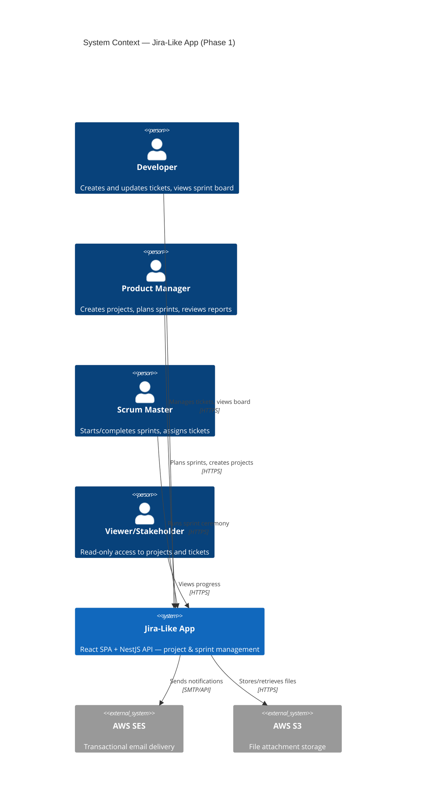

---

## Diagram 2 — MARN Stack Container Diagram

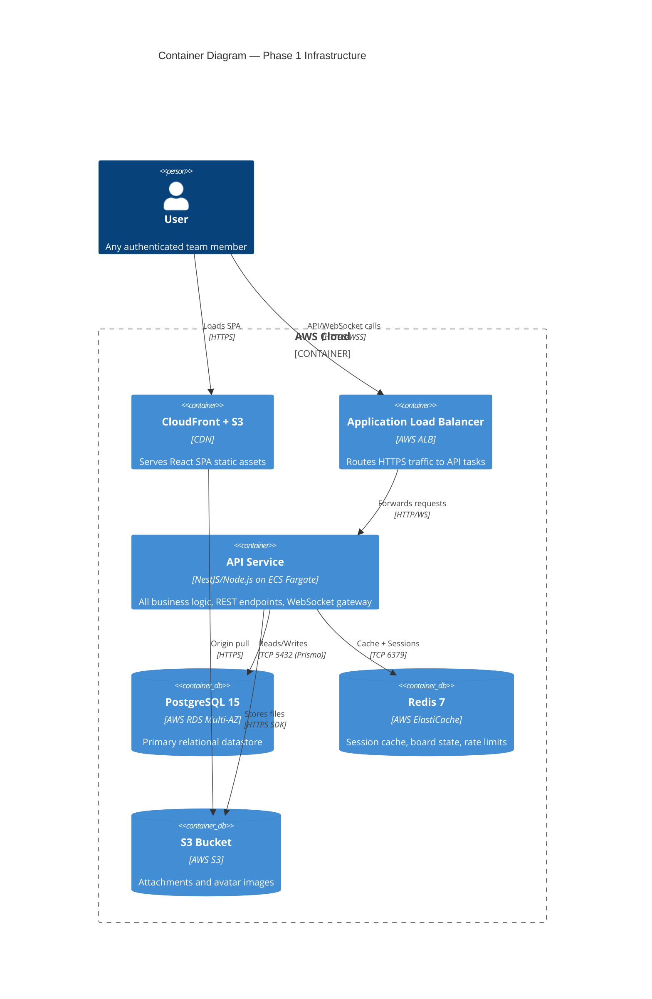

---

## Diagram 3 — Authentication Flow

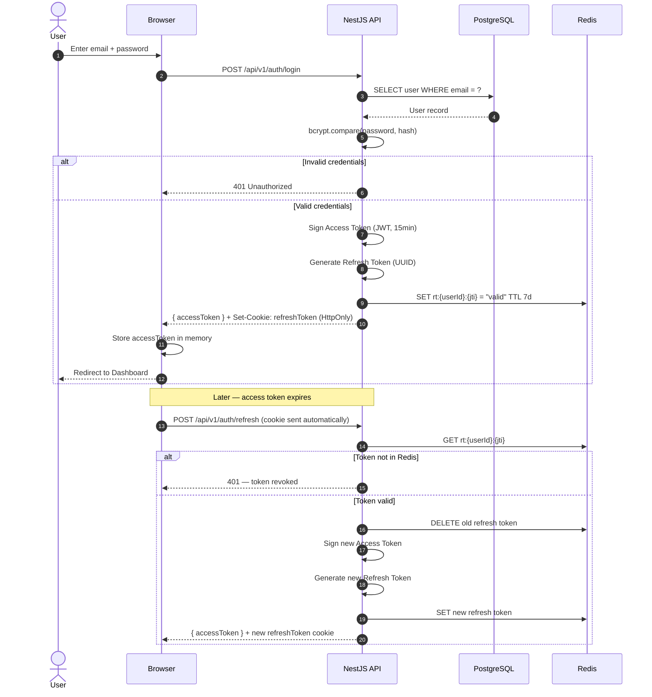

---

## Diagram 4 — Ticket Creation Flow

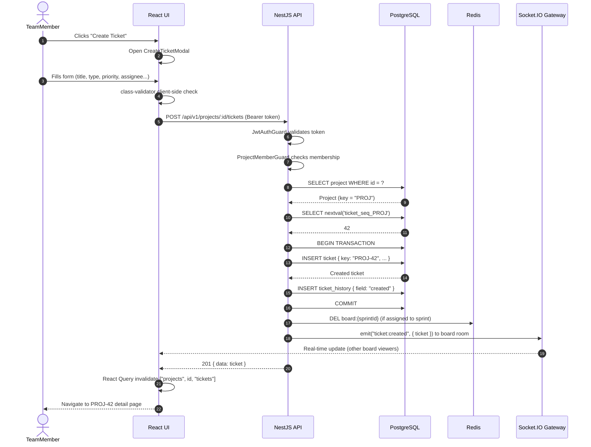

---

## Diagram 5 — Sprint Board Kanban Flow (Drag & Drop)

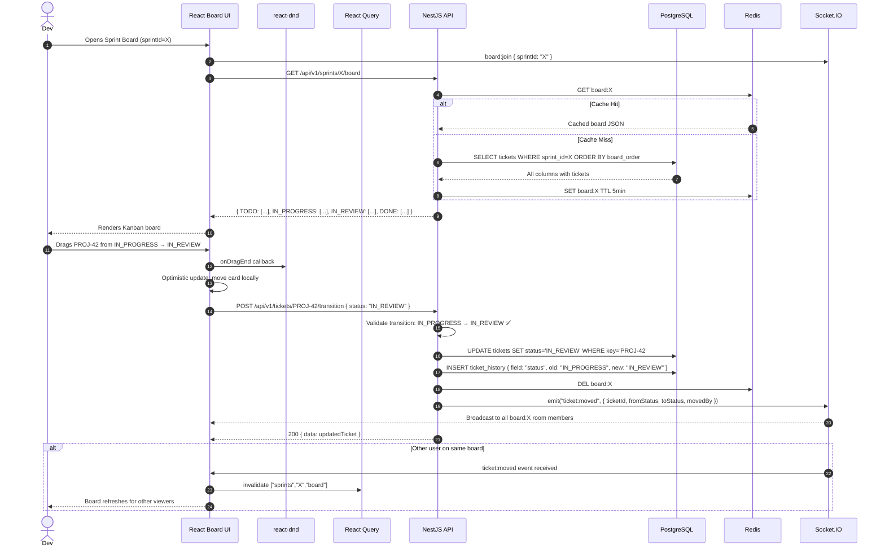

---

## Diagram 6 — Sprint Lifecycle State Machine

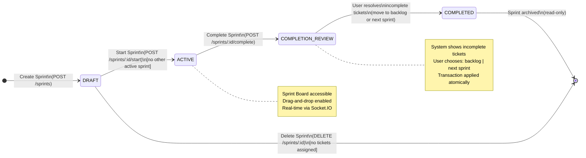

---

## Diagram 7 — Entity Relationship Diagram (Phase 1 Core)

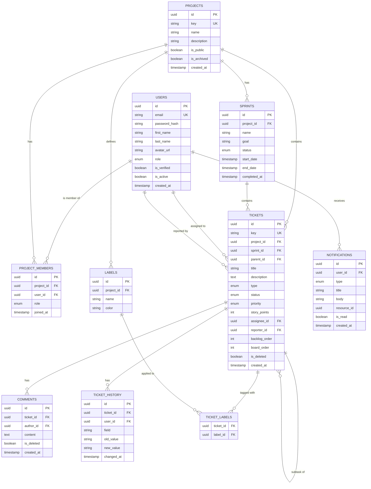

---

## Diagram 8 — Frontend Application Flow (User Journey)

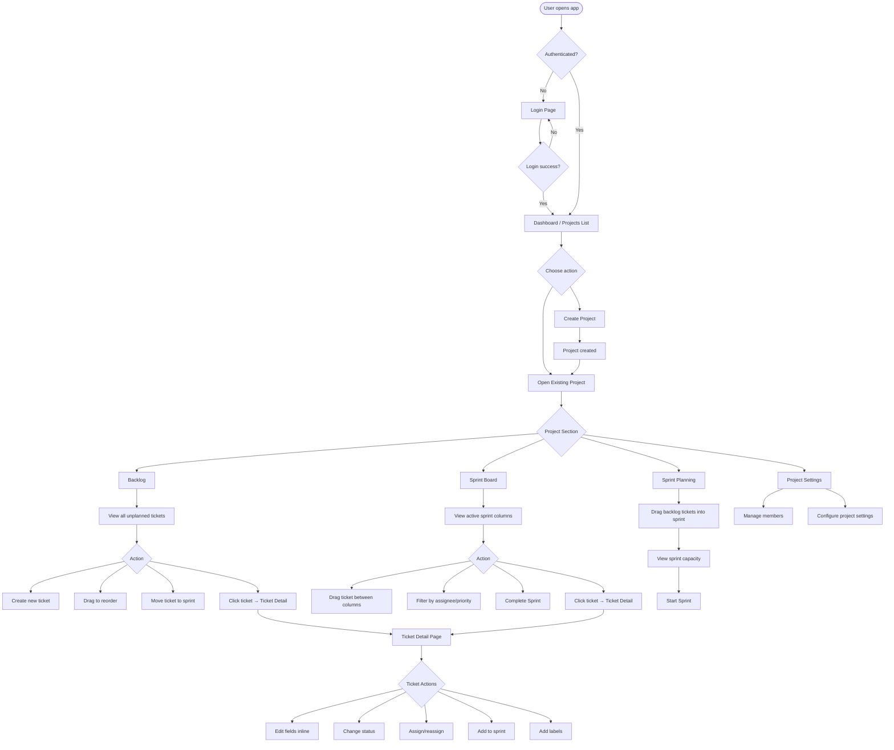

---

## Diagram 9 — CI/CD Pipeline

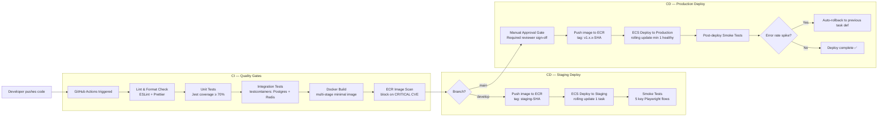

---

## Diagram 10 — RBAC Permission Flow

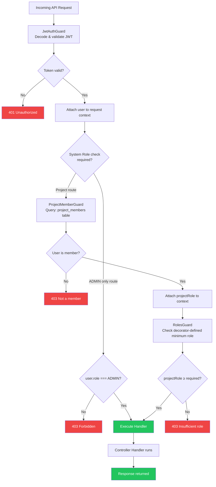

---

## Diagram 11 — Database Migration & Seeding Flow (Sprint 0)

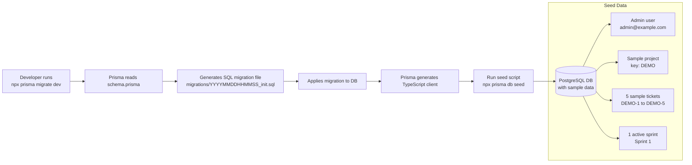

---

## Diagram 12 — Phase 1 Sprint Delivery Timeline

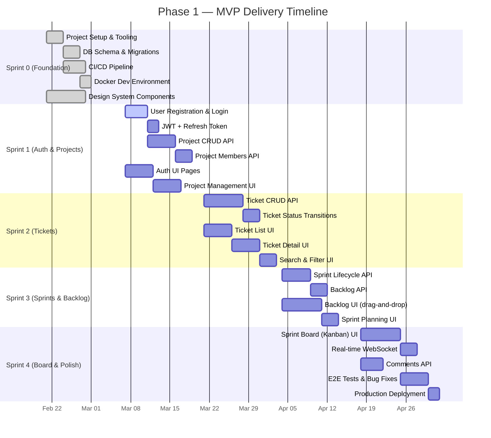
