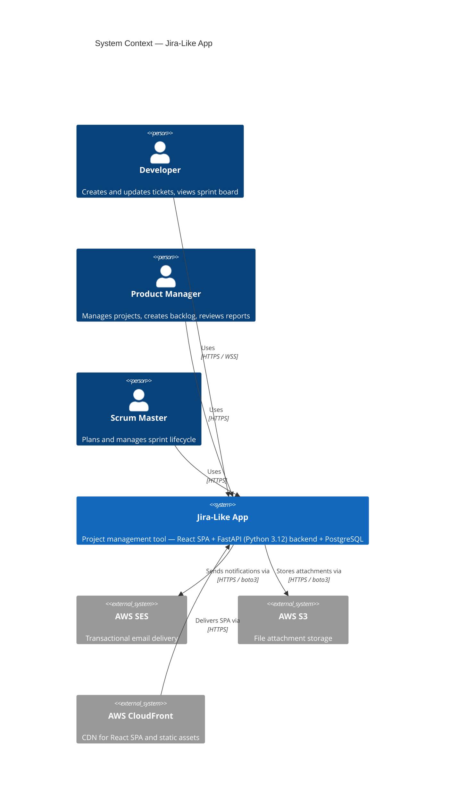
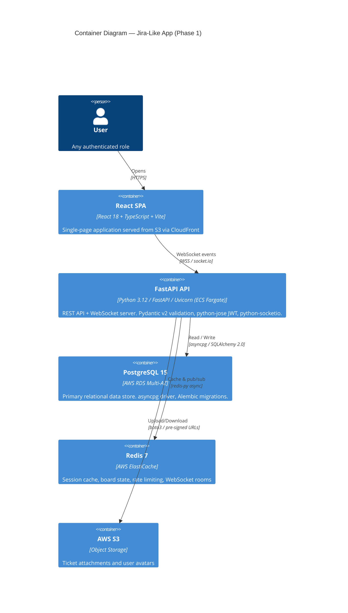
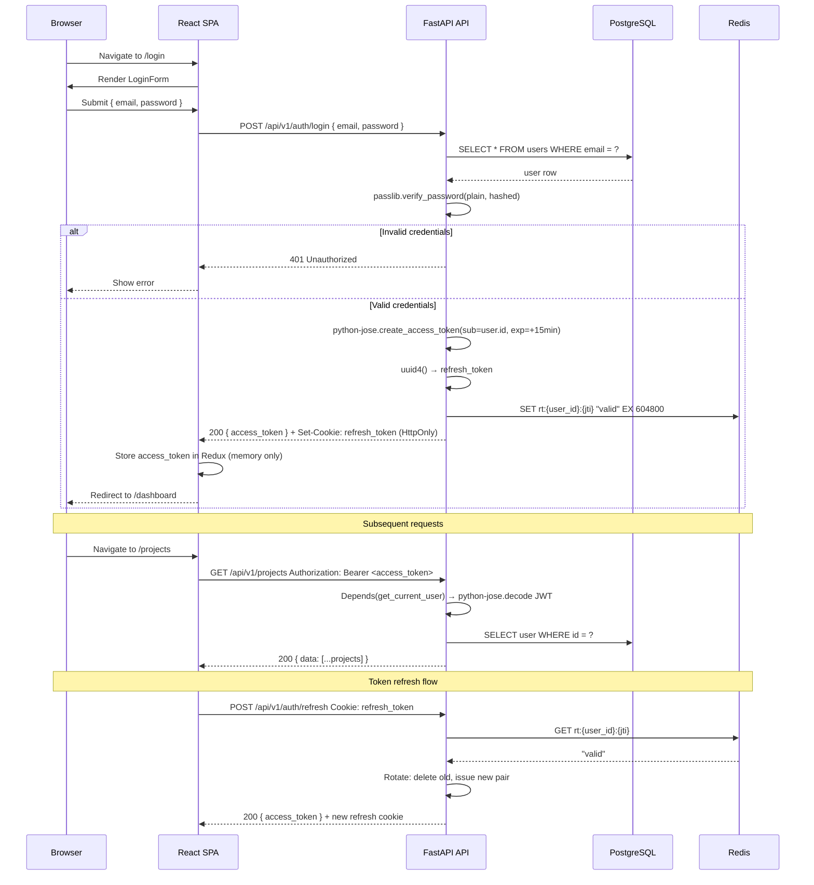
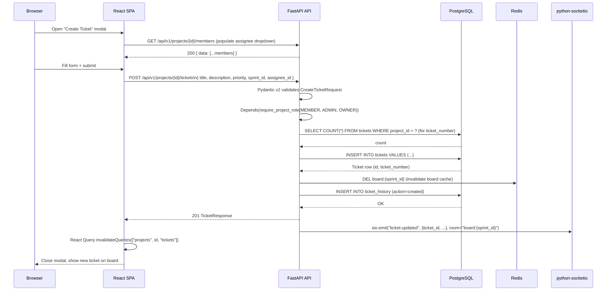
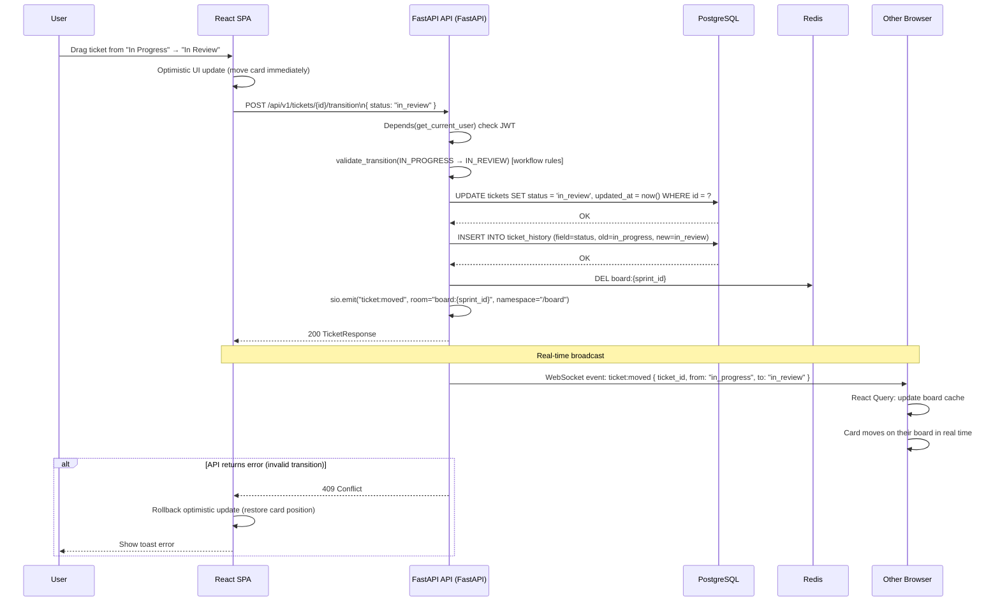
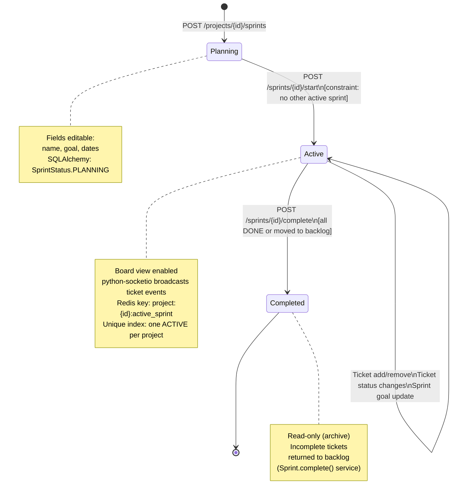
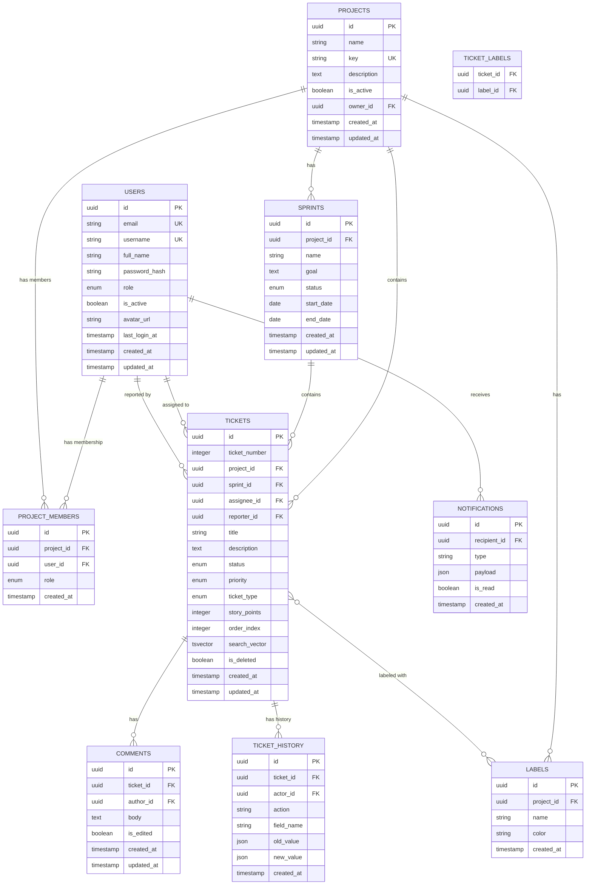
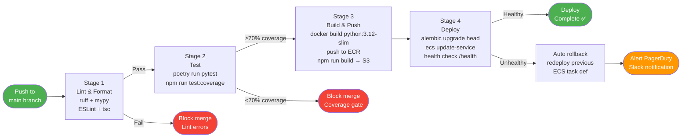
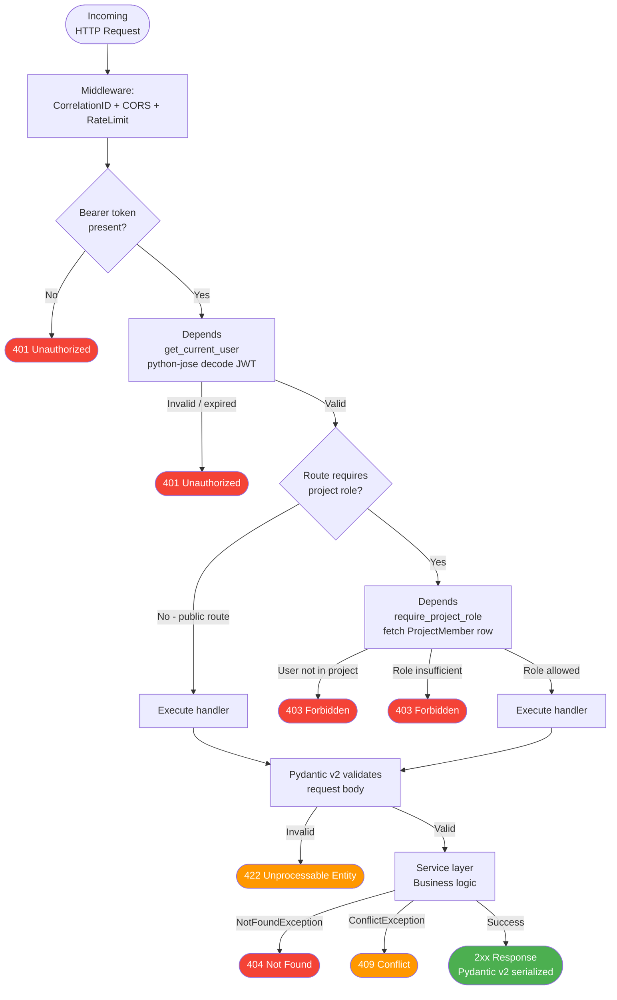
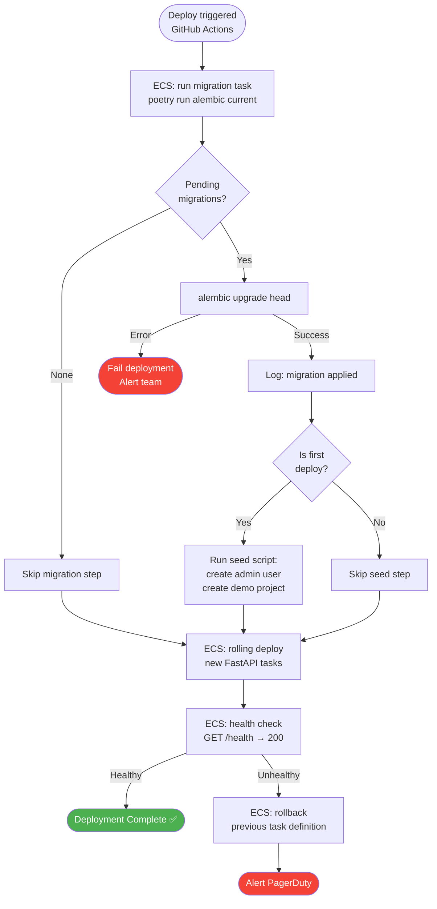

# Phase 1 Mermaid Diagrams
## Jira-Like Project Management Application

**Version**: 2.0 | **Date**: February 21, 2026 | **Stack**: React + FastAPI (Python 3.12) + PostgreSQL + AWS

> All diagrams updated for FastAPI/Python backend. "NestJS API" is now "FastAPI API". CI/CD uses Poetry + pytest.

---

## Diagram 1 — System Context (C4 Level 1)



---

## Diagram 2 — Container Diagram (C4 Level 2)



---

## Diagram 3 — Authentication Flow (Sequence)



---

## Diagram 4 — Ticket Creation Flow (Sequence)



---

## Diagram 5 — Sprint Board Drag-and-Drop (Sequence)



---

## Diagram 6 — Sprint Lifecycle State Machine



---

## Diagram 7 — Entity Relationship Diagram



---

## Diagram 8 — Frontend Application Flow

```mermaid
flowchart TD
    A([User visits app]) --> B{Has access_token\nin Redux?}

    B -->|No| C[Redirect to /login]
    B -->|Yes| D[Verify token exp time]
    D -->|Expired| E[POST /auth/refresh via cookie]
    D -->|Valid| F[Load Dashboard]

    C --> G[Enter credentials]
    G --> H[POST /api/v1/auth/login]
    H -->|401| I[Show error message]
    I --> G
    H -->|200| J[Store access_token in Redux]
    J --> F

    E -->|Success: new token| F
    E -->|Failure: no cookie| C

    F --> K[Load projects list\nGET /api/v1/projects]
    K --> L[Select project]
    L --> M{View?}

    M -->|Backlog| N[GET /projects/{id}/tickets\nstatus=backlog]
    M -->|Board| O[GET /sprints/{id}/board]
    M -->|Sprints| P[GET /projects/{id}/sprints]

    O --> Q[Render Kanban columns\nTodo | In Progress | In Review | Done]
    Q --> R[Connect Socket.IO to\n/board room:{sprint_id}]
    R --> S{WebSocket event?}
    S -->|ticket:moved| T[Update card position in UI]
    S -->|ticket:updated| U[Update card fields]
    S -->|None| V[User action]
    V -->|Drag card| W[POST /tickets/{id}/transition]
    W -->|200| X[React Query invalidate]
    W -->|409 Conflict| Y[Rollback optimistic update]
```

---

## Diagram 9 — CI/CD Pipeline



---

## Diagram 10 — RBAC Permission Flow



---

## Diagram 11 — Database Migration & Seeding Flow



---

## Diagram 12 — Phase 1 Sprint Timeline (Gantt)

```mermaid
gantt
    title Phase 1 MVP — 10 Week Sprint Plan
    dateFormat  YYYY-MM-DD
    axisFormat  %b %d

    section Infrastructure
    AWS Setup + ECS + RDS + Redis          :done,    infra1, 2026-03-01, 5d
    Dockerfile (python:3.12-slim) + ECR    :done,    infra2, after infra1, 3d
    GitHub Actions CI/CD (pytest + poetry) :done,    infra3, after infra2, 3d
    FastAPI scaffold + Alembic init        :done,    infra4, 2026-03-01, 5d

    section Backend Core
    SQLAlchemy models + Alembic migrations :done,    be1, 2026-03-06, 5d
    Auth (python-jose, passlib, Redis RT)  :done,    be2, after be1, 5d
    User & Project APIs (FastAPI routers)  :done,    be3, after be2, 5d
    Ticket CRUD + Workflow rules           :active,  be4, after be3, 7d
    Sprint CRUD + Board endpoint           :         be5, after be4, 5d
    Search (PostgreSQL tsvector)           :         be6, after be5, 3d
    python-socketio real-time events       :         be7, after be3, 7d

    section Frontend
    React + Vite project scaffold          :done,    fe1, 2026-03-01, 3d
    Auth pages + Redux auth slice          :done,    fe2, after fe1, 5d
    Project + Backlog pages                :done,    fe3, after fe2, 5d
    Sprint Board (Kanban drag-and-drop)    :active,  fe4, after fe3, 7d
    Socket.IO integration                  :         fe5, after be7, 5d
    Search & Filter UI                     :         fe6, after fe4, 4d

    section Testing & QA
    Backend: pytest (unit + integration)   :         qa1, 2026-04-01, 7d
    Frontend: Vitest + React Testing Lib   :         qa2, 2026-04-01, 7d
    E2E: Playwright critical flows         :         qa3, after qa1, 5d
    Performance baseline                   :         qa4, after qa3, 3d

    section Phase 1 Milestone
    MVP Ready for Review                   :milestone, m1, 2026-04-20, 0d
```
